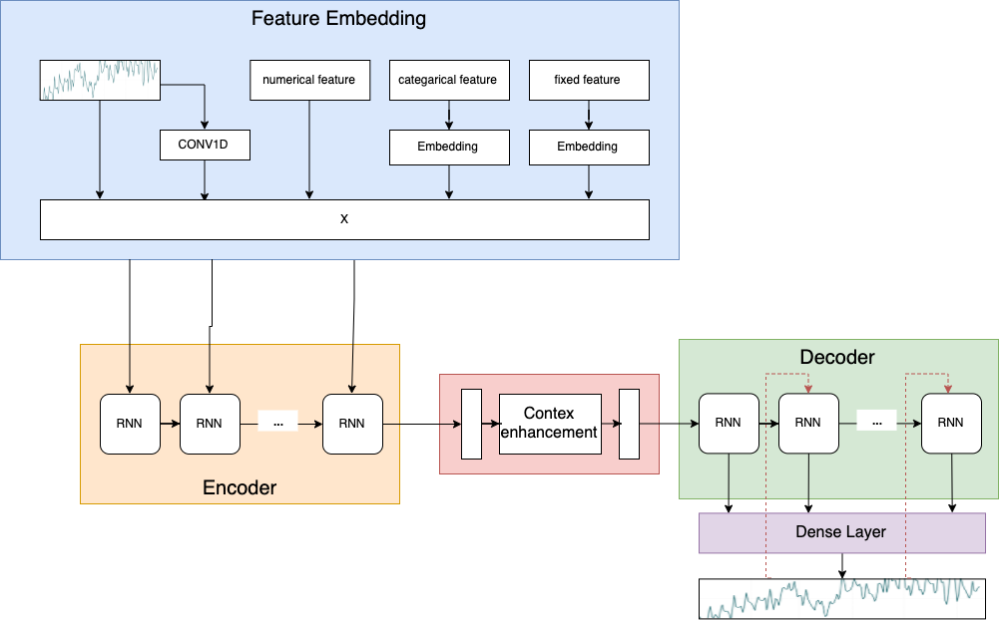

# PyTorch Time Series Forecasting

## Contributions of this repository
- PyTorch implementation on popular neural network time series forecasting solutions
- beginner friendly: comments with tensor dimensions

## Algorithms
- Seq2Seq
- WaveNet

## Examples
- seq2seq: `./examples/M5-forecasting-seq2seq.ipynb`

- WaveNet: `./examples/M5-forecasting-wavenet.ipynb`

## Reference
- Seq2Seq
    - https://github.com/Arturus/kaggle-web-traffic
    - https://github.com/bentrevett/pytorch-seq2seq
    - https://github.com/JEddy92/TimeSeries_Seq2Seq
- WaveNet
    - https://github.com/NVIDIA/nv-wavenet/blob/03f69576f6c6b984340c1ddef2288e3f7d1102ca/pytorch/wavenet.py
    - https://github.com/JEddy92/TimeSeries_Seq2Seq/blob/master/notebooks/TS_Seq2Seq_Conv_Full_Exog.ipynb
    - https://github.com/sjvasquez/web-traffic-forecasting/blob/master/cnn.py
    - https://github.com/vincentherrmann/pytorch-wavenet/blob/master/wavenet_training.py